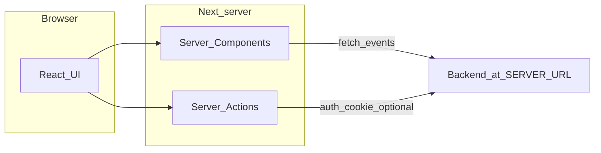

# GG Casino

Built with Next.js. The UI talks to a **separate HTTP API**; configure its base URL via environment variables.

## Prerequisites

- **Node.js** 20.x (recommended; aligns with `@types/node` in this repo)
- **pnpm** (this repo uses [`pnpm-lock.yaml`](pnpm-lock.yaml)) or another package manager — if you use something else, delete `pnpm-lock.yaml` first

## Install

1. Clone this repository:

   ```bash
   git clone
   cd mock-api
   ```

2. Install dependencies (From the repository root):

```bash
pnpm install
```

## Configuration

The repo includes [`.env.example`](.env.example). Rename it to `.env` and update the values.

| Variable               | Required                    | Purpose                                                                                                                                                                                                                                                                             |
| ---------------------- | --------------------------- | ----------------------------------------------------------------------------------------------------------------------------------------------------------------------------------------------------------------------------------------------------------------------------------- |
| `SERVER_URL`           | **Yes** for a working app   | Base URL of the backend API (with or without a trailing slash; event fetching normalizes it). Used for auth and data: e.g. `/login`, `/me`, `/events/euroleague`, `/events/eurovision`. If unset, server-side calls throw a configuration error. Example: `https://api.example.com` |
| `NEXT_PUBLIC_SITE_URL` | No                          | Canonical site origin for metadata, sitemap, and robots (no trailing slash). If unset locally, defaults to `http://localhost:3001`. Set in production, e.g. `https://www.example.com`                                                                                               |
| `VERCEL_URL`           | Set automatically on Vercel | Used as a fallback for site origin when `NEXT_PUBLIC_SITE_URL` is not set                                                                                                                                                                                                           |

## Run

Scripts are defined in [`package.json`](package.json). The dev and production servers use **port 3001**.

| Command      | Description                                            |
| ------------ | ------------------------------------------------------ |
| `pnpm dev`   | Start Next.js in development mode (`next dev -p 3001`) |
| `pnpm build` | Production build                                       |
| `pnpm start` | Start production server (`next start -p 3001`)         |
| `pnpm lint`  | Run ESLint                                             |

Open [http://localhost:3001](http://localhost:3001) after `pnpm dev`.

## Implemented features

- **Home** (`/`) — Hero, Euroleague and Eurovision betting sections, link to the full bets area ([`src/app/page.tsx`](src/app/page.tsx)).
- **Lažybos** (`/lazybos`) — Dedicated betting page with the same event sections ([`src/app/lazybos/page.tsx`](src/app/lazybos/page.tsx)).
- **Registration** (`/registracija`) and **login** (`/prisijungti`) — Guest-only route group; authenticated users are redirected home ([`src/app/(guest)/layout.tsx`](src/app/%28guest%29/layout.tsx)).
- **Wallet** (`/pinigine`) — Balance and transaction history with URL-driven filters ([`src/app/(protected)/pinigine/page.tsx`](src/app/%28protected%29/pinigine/page.tsx)).
- **My bets** (`/mano-statymai`) — Bet history with URL-driven filters ([`src/app/(protected)/mano-statymai/page.tsx`](src/app/%28protected%29/mano-statymai/page.tsx)).
- **Protected routes** — Layout checks session; unauthenticated users are sent to `/prisijungti` ([`src/app/(protected)/layout.tsx`](src/app/%28protected%29/layout.tsx)).
- **Navigation** — Main nav items and auth-gated links for wallet and my bets ([`src/constants/nav.ts`](src/constants/nav.ts)).
- **Header** — Sticky header with nav, optional balance link, theme switcher, mobile menu ([`src/components/Header/Header.tsx`](src/components/Header/Header.tsx)).
- **SEO** — Root metadata ([`src/app/layout.tsx`](src/app/layout.tsx)), [`sitemap.ts`](src/app/sitemap.ts) (public URLs `/` and `/lazybos`), [`robots.ts`](src/app/robots.ts), [`manifest.ts`](src/app/manifest.ts). Guest and protected layouts adjust `robots` (e.g. noindex where appropriate).

> **Note:** The app shell uses `lang="lt"`. The header shows an LT/EN language control as UI only; English locale routing is not wired in this codebase.

## Technical decisions

- **Stack:** Next.js 16.x, React 19.x, TypeScript, Tailwind CSS 4.x, ESLint 9 with `eslint-config-next`.
- **React Compiler** — Enabled in [`next.config.ts`](next.config.ts) (`reactCompiler: true`).
- **SVG imports** — Turbopack maps `*.svg` to `@svgr/webpack` so icons can be imported as React components ([`next.config.ts`](next.config.ts)).
- **TanStack React Query** — Server: one `QueryClient` per request via React `cache`; browser: singleton client ([`src/lib/query/getQueryClient.ts`](src/lib/query/getQueryClient.ts)). Public pages prefetch event queries in RSC and hydrate with `HydrationBoundary`.
- **Events on public pages** — [`src/lib/api/events/fetchOnServer.ts`](src/lib/api/events/fetchOnServer.ts) uses a **static** fetch mode (`revalidate: false` against the backend), combined with `dynamic = "force-static"` on home and `/lazybos`, so listings are a **long-lived static snapshot** (e.g. at build time) rather than live `no-store` odds. The shared upstream helper still supports a live mode for other callers.
- **Auth** — Cookie-based session validated with `GET /me` and forwarded cookies ([`src/lib/auth/getSession.ts`](src/lib/auth/getSession.ts), [`src/helpers/authFetch.ts`](src/helpers/authFetch.ts)). There is **no** `middleware.ts`; access control lives in **route-group layouts**.
- **Server actions** — Login, register, logout, session helpers, place bet, and cancel bet live under [`src/actions/`](src/actions/) and call the backend through `authFetch` (including `Set-Cookie` handling where needed).
- **Forms** — TanStack React Form with Zod for validation.
- **Theming** — `next-themes` with `attribute="class"` and system default in the root layout.
- **Next.js docs** — This project targets a recent Next major version with breaking changes relative to older tutorials. Prefer the guides under `node_modules/next/dist/docs/` when in doubt (see [`AGENTS.md`](AGENTS.md)).

## Architecture (high level)



Authenticated flows forward session cookies from the Next server to the API; login/register responses can apply `Set-Cookie` via server-side handling ([`authFetch`](src/helpers/authFetch.ts)).
